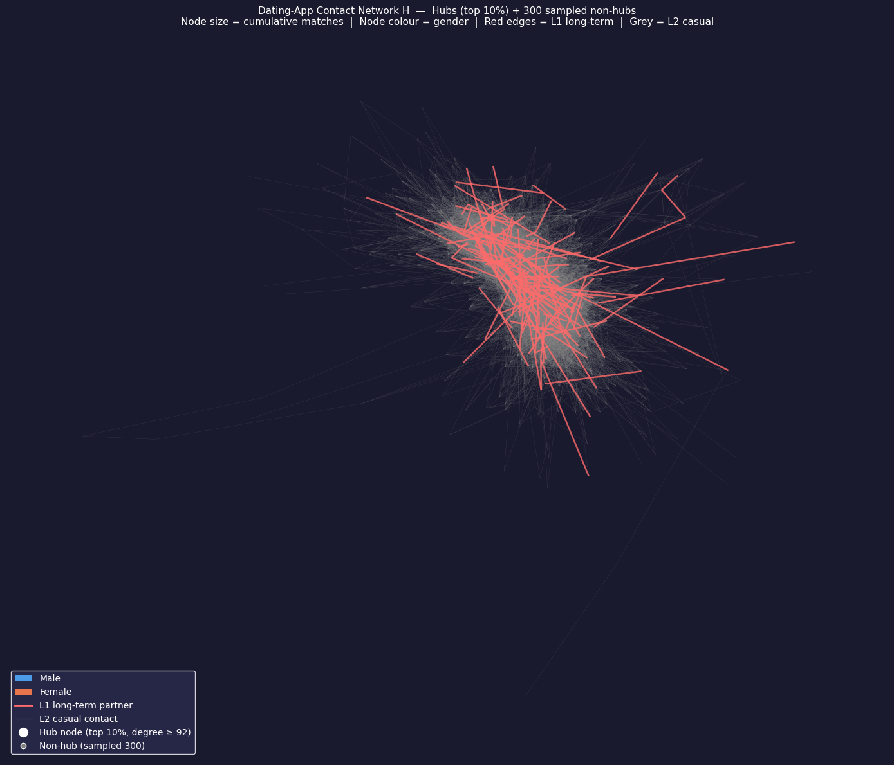
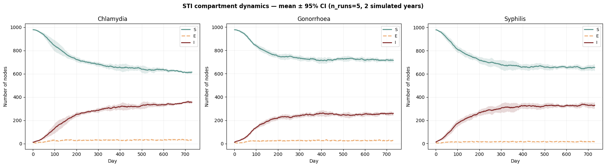
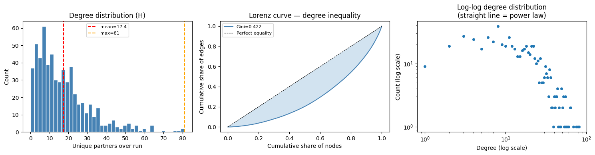
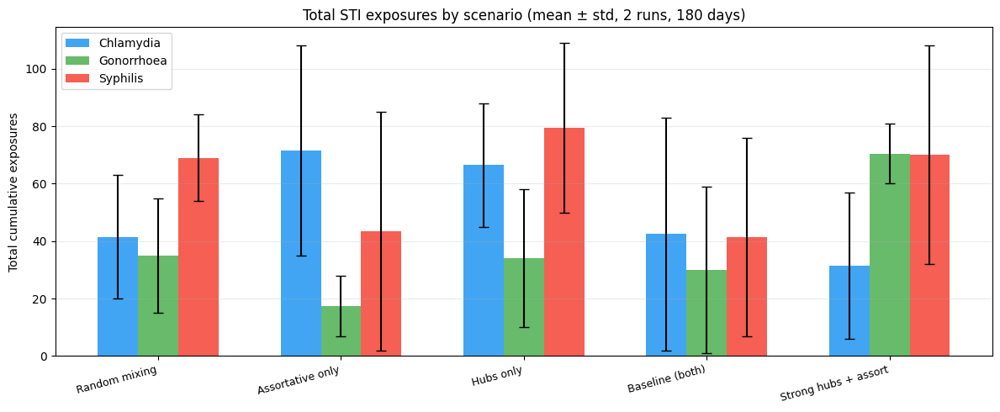

# Beyond Random Pairing: Modelling Assortative Matching and Hub Formation in Online Dating Networks

## Executive Summary

Online dating platforms do more than expand the pool of potential partners—they fundamentally reshape how social and sexual networks form. By exposing users to large candidate pools, amplifying visibility through platform mechanics, and enabling preference-based filtering, dating applications generate network structures that differ substantially from traditional partner formation processes.

These structural differences matter because diffusion processes—whether information, behaviors, or infectious diseases—depend not only on individual characteristics but also on the architecture of the network through which they spread. Features such as highly connected "hub" users and clustered communities can significantly alter transmission dynamics relative to randomly mixed populations.

> **Research Question:**  
> How do assortative matching and popularity concentration (hub formation), calibrated from real dating-app behaviour, influence diffusion dynamics within an agent-based network simulation?

Using approximately 60,000 OKCupid user profiles, this project develops an agent-based model that combines empirically calibrated network formation mechanisms with a multi-pathogen epidemiological simulation, enabling the analysis of how platform-driven network structures influence diffusion outcomes.

📄 [Read the Full Report](report/project_report.pdf)

### Authors:
- *Cecilia lo Cicero*: (https://github.com/ceciliaalocicero)
- *Alissa Sharuda*: (https://github.com/jamaisisolee)
- *Sara Pulidori*: (https://github.com/spulidori)
- *Anna Ciparelli*
---

## Motivation

Many epidemiological and diffusion models rely on simplified assumptions regarding partner formation, often approximating interactions as random or only loosely structured. While such assumptions improve tractability, they overlook important mechanisms that are increasingly relevant in digitally mediated environments.

Empirical research on online dating platforms consistently finds that users do not connect randomly. Instead, two structural forces emerge repeatedly:

- **Assortative matching**: users systematically prefer partners who are similar across demographic and behavioural dimensions.
- **Popularity concentration (hub formation)**: a small subset of highly visible users receives a disproportionate share of interactions.

Together, these mechanisms shape the topology of the resulting contact network. Understanding their effects is essential for evaluating how digital platforms influence diffusion processes and for assessing the broader consequences of algorithmically mediated social interactions.

---

## Literature Foundation

This modelling framework builds directly upon **Lazebnik (2024)**, which introduced a simulation of dating-app-driven STI transmission but treated partner formation largely as a random process.

To address this limitation, the network formation layer was reconstructed using empirical findings from multiple research streams:

- **Assortative matching preferences** were calibrated using estimated partner preference effects reported by **Hitsch, Hortaçsu & Ariely (2010)**.
- **Hub formation dynamics** were informed by network science literature on preferential attachment and degree concentration, including **Barabási & Albert (1999)** and **Pastor-Satorras & Vespignani (2001)**.
- Additional behavioural assumptions were grounded in empirical studies of online dating platform usage and matching behaviour.

As a result, model parameters were derived from published empirical evidence rather than selected arbitrarily, allowing the simulation to more closely reflect observed platform dynamics.

---

## Methodology

### Data Preparation

The model uses the publicly available OKCupid dataset containing approximately 60,000 user profiles. Demographic and behavioural variables were cleaned, standardized, and filtered to construct a realistic simulation population.

### Agent Construction

Each simulated user is represented as a heterogeneous agent characterized by attributes including:

- Age
- Gender
- Ethnicity
- Education
- Religion
- Smoking habits
- Drinking habits
- Drug use

These attributes directly influence matching behaviour and network formation.

### Assortative Matching

Partner selection is governed by a similarity-based mechanism calibrated from empirical preference estimates. Users exhibit varying degrees of preference for similarity across demographic and behavioural dimensions, generating homophilic network structures.

### Hub Formation

The model incorporates popularity-driven matching dynamics in which previously successful users become increasingly visible to others. This mechanism produces endogenous hub formation and degree heterogeneity without imposing hubs *ex ante*.

### Dynamic Network Formation

The contact network evolves over time through repeated matching, relationship formation, dissolution, and user turnover. Network structure therefore emerges from agent behaviour rather than being predefined.

### Epidemiological Layer

A multi-pathogen **SEIS (Susceptible–Exposed–Infectious–Susceptible)** framework is applied to the evolving network, allowing disease transmission to occur through dynamically generated contacts.

The model simulates:

- Chlamydia
- Gonorrhoea
- Syphilis

### Scenario Analysis

To isolate the impact of different structural mechanisms, multiple counterfactual scenarios were evaluated, including:

- Random mixing
- Assortative matching only
- Hub formation only
- Combined calibrated model
- Enhanced hub concentration

---

## Key Technical Components

- Agent-Based Modelling (ABM)
- Dynamic Network Formation
- Network Science & Graph Analysis
- SEIS Epidemiological Modelling
- Monte Carlo Simulation
- Statistical Calibration from Literature
- Data Engineering & Feature Construction
- Scenario-Based Policy Analysis

---

## Main Findings

The simulation produces several consistent insights:

- Hub users emerge naturally as highly influential cross-community connectors.
- Network topology has a measurable impact on diffusion outcomes.
- Assortative matching and hub formation generate transmission patterns that differ substantially from random-mixing assumptions.
- Moderate homophily can partially constrain diffusion by reducing cross-group transmission pathways.
- Structural properties of digital platforms can influence diffusion dynamics independently of individual behavioural changes.

These findings highlight the importance of explicitly modelling network formation mechanisms when evaluating diffusion processes in digitally mediated environments.

---
## Selected Results

### Emergent Network Structure

The simulation generates a heterogeneous contact network in which highly connected hub users emerge naturally through popularity-driven matching dynamics. These hubs act as bridges between otherwise clustered communities and play a disproportionate role in diffusion processes.

---

### STI Diffusion Dynamics

Disease transmission is simulated using a multi-pathogen SEIS framework operating on the dynamically evolving contact network.

---

### Degree Distribution Diagnostics

The resulting network exhibits degree heterogeneity and concentration patterns consistent with the emergence of hub users.

---

### Scenario Analysis

Counterfactual experiments compare random mixing, assortative matching, hub formation, and combined mechanisms.

---

## Skills Demonstrated

- Python
- Pandas
- NumPy
- NetworkX
- Data Cleaning & Feature Engineering
- Agent-Based Modelling
- Simulation Design
- Statistical Calibration
- Research Translation
- Network Analysis
- Scenario Modelling
- Computational Social Science

---

## Repository Contents

| File | Description |
|--------|--------|
| `Ciapparelli_Lo_Cicero_Pulidori_Sharuda.ipynb` | Main simulation model |
| `Ciapparelli_Lo_Cicero_Pulidori_Sharuda_EDA.ipynb` | Exploratory data analysis and preprocessing |
| `project report.pdf` | Full technical report |

---

## Data Source

**OKCupid Profiles Dataset**

https://www.kaggle.com/datasets/andrewmvd/okcupid-profiles

